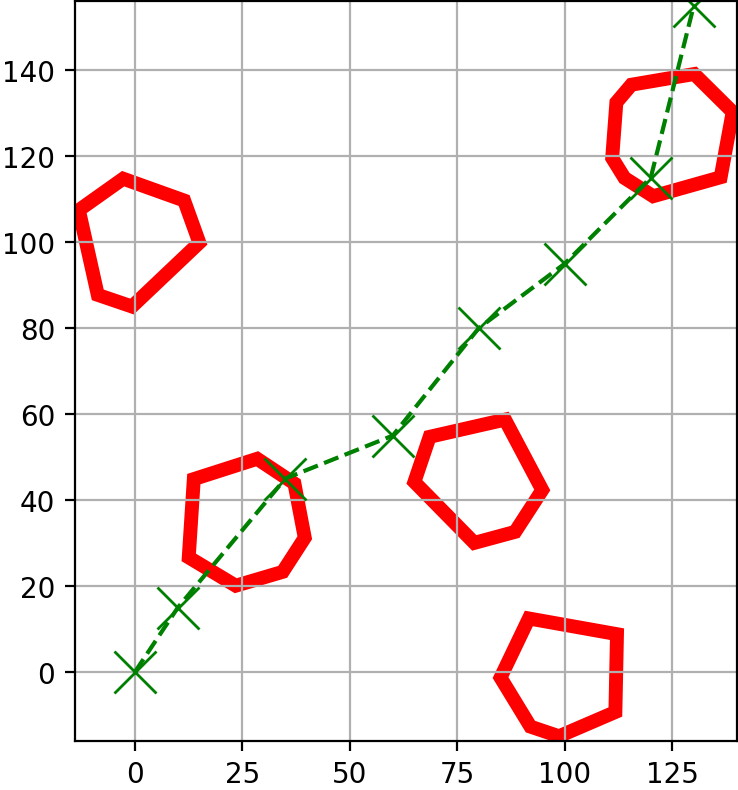
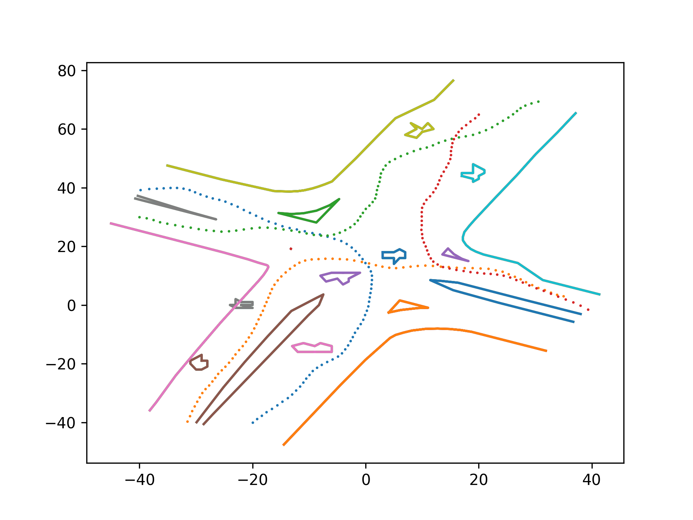

# Path Planning and Decision Making ETH 2022

**1. Graph search**
- Breadth first search
- Depth first search
- Iterative Deepening

 

**2. Informed graph search**
- Uniform cost search
- Astar

 

**3. Dynamic Programming**
- Value iteration
- To Do: Debug value iteration
- Policy iteration

   

**4. Steering**
- Dubin's Paths
- To Do: Add LRL and RLR curves, Reeds-Shepp curves

  

**5. Collision Checking**
- Point-Circle Collision Checking Procedure
- Point-Triangle Collision Checking Procedure
- Point-Polygon Collision Checking Procedure
- Segment-Circle Collision Checking Procedure
- Segment-Triangle Collision Checking Procedure
- Segment-Polygon Collision Checking Procedure
- Optimization via Axis-Aligned Bounding Boxes
- Collision Checking Procedure for Circle-shaped Robot
- Collision Checking via Occupancy Grid
- Collision Checking using R-Trees
- Collision Checking in Robot Frame
- Collision Checking via Safety Certificates

  

**6. Optimization (Pulp)**

Mixed integer linear program optimizing a voyage plan of a pirate ship passing several islands:
- Minimum nights
- Maxmize crew size
- Miinimize total sailing time
- Minimize total L1 norm
- Minimize maximum individual sailing time

constraint to:
- Voyage order
- Minimum crew size
- Maximum crew size
- Maximum duration
- Maximum L1 norm

**7. Driving Games**

Planning and control stack for a car with simulation interface: https://github.com/idsc-frazzoli/dg-commons. 
- Planning with RRT
- Control with pure-pursuit to get the steering angle reference and PID to track steering and speed reference
- To do: debug multiplayer

https://user-images.githubusercontent.com/75450536/219868598-d9246214-9988-4386-ad6e-2a9eb6999a11.mp4

